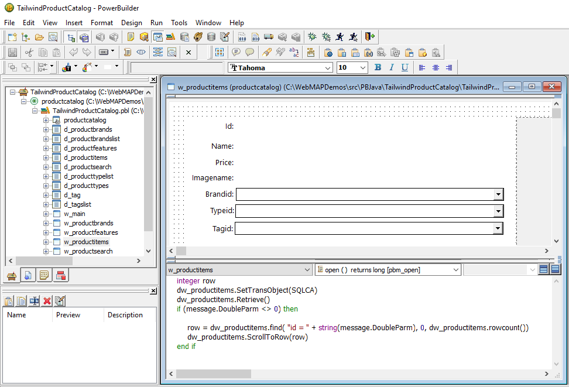
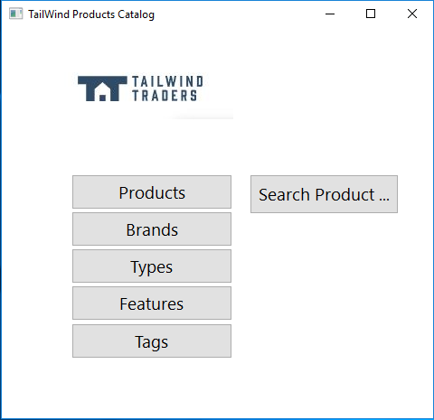
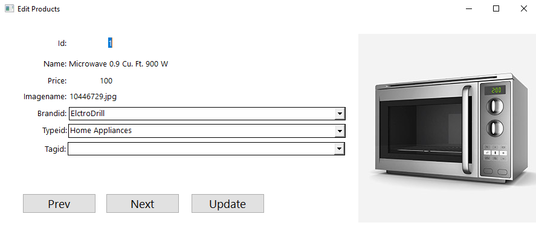
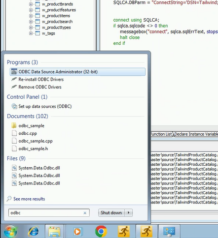
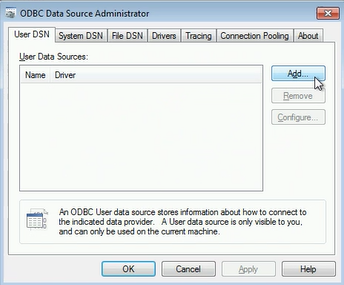
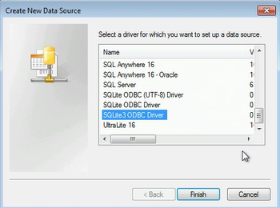
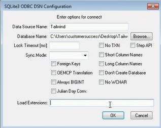

Tailwind Traders is a fictitious retail company showcasing the future of intelligent application experiences.

Tailwind Traders’ business has technology at its heart—it blends the ease of online shopping with the familiarity of a mom-n-pop corner hardware store – and is quickly making a name for itself in the relatively new virtual hardware market. Like many modern organizations, it has evolving internal and external technology needs, and it approaches each moment of transformation with confidence.

Tailwind Traders, a forward-thinking retail business with a diverse set of needs. This business highlights various challenges real-world organizations face as they modernize and transform. The challenges should be familiar to you and your business even if the details differ.

The company wants to hosts its entire infrastructure on Microsoft Azure, and serves as the blueprint for modern retail.

Northwind Traders kept the bulk of its data in an on-premises data center, which hosted servers running both SQL Server and MongoDB. With some applications running on legacy platforms like Powerbuilder.

After the acquisition, Tailwind Traders worked with the Northwind team to move their data center entirely to Azure.

As part of this process they modernized their Powerbuilder to Java in order to host it on Azure.

This repository holds the original Powerbuilder application.

This application uses datawindow controls to edit the product catalog, and it used dropdown datawindows to display the master-detail relationship with the brands, types and tags tables.

# Product Catalog Screens

# Steps to configure and run the tailwind traders Power Builder application

If you want to run the Power Builder application, you must follow the next steps:

1. Download the code.
2. Open the TailwindProductCatalog PowerBuilder workspce locate in the source folder (use PB 10 or later).
3. You need to configure the Datasource that will be used by the application. To do that you first need to download an install the SQL Lite ODBC driver. To download the driver, go to the following url: ***http://www.ch-werner.de/sqliteodbc/***
and download the ***sqliteodbc.exe*** file.
4. Run the downloaded executable to install the driver.
5. After installing the driver, go to windows start menu, search for ODBC and open ***ODBC Data Source Administrator***.

6. In the ODBC Administrator, in the User DSN tab click on the Add button to add a new Datasource:

7. Select the driver ***SQLite3 ODBC Driver*** from the list of drivers and click Finish.

8. In the Datasource configuration screen add the following information:
    Datasource Name: Tailwind
    Database Name: Add the path to the ***tailwind.db file*** (you can find the file in the root of the repository).

9. You can go to the PB IDE and execute the application. If you want to check if the connection is working ok, or review the connection string created to connect to the Database, you can check and review the Open() method in w_main.